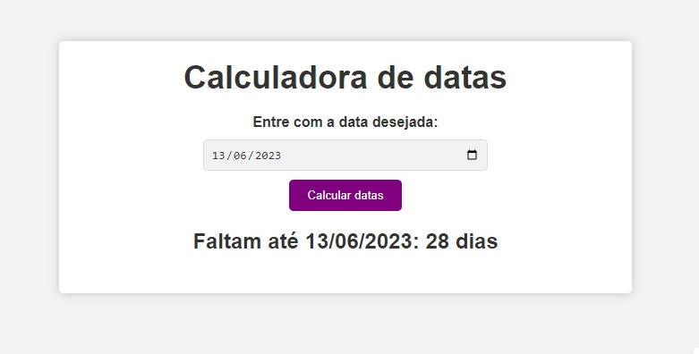
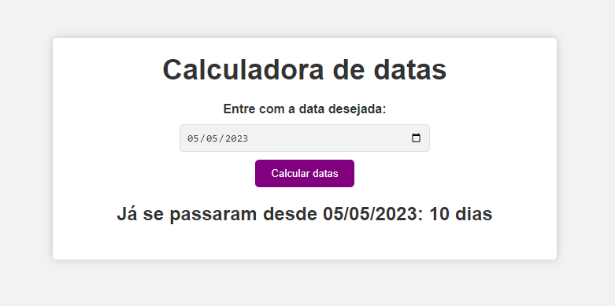

# Calculadora de Distância entre Datas

Este é um projeto de uma calculadora simples que permite calcular a distância entre uma data escolhida e a data atual. O projeto é desenvolvido utilizando HTML, CSS e JavaScript.

## Funcionalidades

- Insira uma data no formato DD/MM/AAAA.
- Clique no botão "Calcular" para obter a distância entre a data escolhida e a data atual em dias.

## Pré-requisitos

Certifique-se de ter os seguintes softwares instalados:

- Navegador da web (Google Chrome, Mozilla Firefox, etc.).

## Instruções de uso

1. Faça o download ou clone este repositório em sua máquina local.
2. Navegue até o diretório do projeto.
3. Abra o arquivo `index.html` em um navegador da web.

## Exemplo de uso

1. Insira uma data no campo "Data" no formato DD/MM/AAAA.
2. Clique no botão "Calcular Data".
3. O resultado será exibido abaixo do botão, mostrando a distância em dias entre a data escolhida e a data atual.

## Personalização

Você pode personalizar o projeto de acordo com suas preferências. Aqui estão algumas sugestões:

- Altere o estilo da calculadora modificando o arquivo `style.css`.
- Adicione validações adicionais para garantir que a data seja inserida corretamente.
- Expanda a funcionalidade para calcular a diferença em outras unidades de tempo, como semanas, meses ou anos.

## Contribuição

Contribuições são bem-vindas! Se você tiver sugestões, melhorias ou correções, sinta-se à vontade para abrir um problema ou enviar um pull request para este repositório.

---

Se você tiver alguma dúvida ou precisar de mais informações, sinta-se à vontade para entrar em contato.